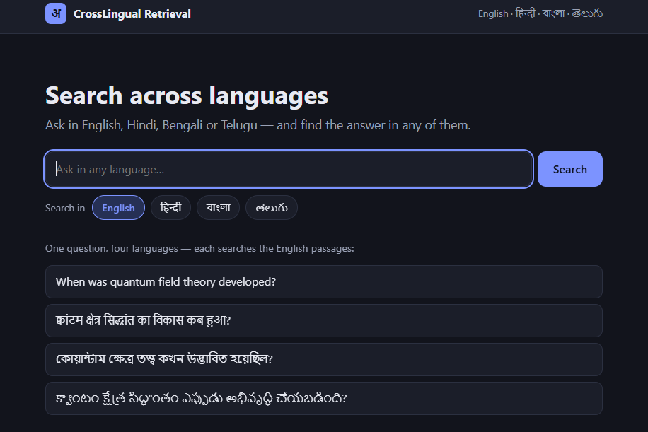

# Cross-Lingual Academic Retrieval

Search a passage collection in **English, Hindi, Bengali or Telugu** using a query written in **any of those languages**. Type a question in English and get relevant Hindi passages back, or the other way round.

Built with FastAPI (backend), React + Vite (frontend) and multilingual sentence embeddings.



## Features
- Cross-lingual search across 4 languages (16 query → corpus combinations)
- Three retrieval modes: `bm25` (keyword), `dense` (embeddings), `hybrid` (rank fusion)
- Automatic query-language detection from the script (Devanagari, Bengali, Telugu, otherwise English)
- Optional cross-lingual boosters: query translation and cross-encoder reranking
- Passage detail page, with the same passage viewable in any language
- Evaluation tooling: Recall@10 / MRR@10 for every language pair, plus off-topic calibration

## How it works
```
query ──► detect language ──► (translate to corpus language, cross-lingual only)
                │
                ├─► dense search  (multilingual-e5, cosine similarity)
                └─► BM25 search   (on the translated query when languages differ)
                         │
                  Reciprocal Rank Fusion
                         │
                  cross-encoder rerank (top 30) ──► top-k results
```
Details and results are in [docs/methodology.md](docs/methodology.md).

## Project structure
```
backend/
  app/
    main.py            FastAPI app, CORS, index warm-up
    config.py          languages, model names, feature flags
    routes/            /api/search, /api/papers
    services/
      data_loader.py   load dataset, build corpus / queries
      preprocessing.py tokenizer + stopwords for Indic scripts
      bm25.py          BM25 index
      embeddings.py    sentence-transformer wrapper
      dense_retrieval.py  dense index + evaluation matrix
      retrieval.py     search pipeline (translate, fuse, rerank)
      translate.py     query translation (NLLB)
      reranker.py      cross-encoder reranker
      calibration.py   off-topic query analysis
  data/download_dataset.py
frontend/              React + Vite UI
experiments/results/   saved evaluation outputs
docs/                  dataset, methodology, references
```

## Setup

### 1. Backend
```bash
cd backend
python -m venv venv
venv\Scripts\activate            # Windows   (Linux/macOS: source venv/bin/activate)
pip install -r requirements.txt
python data/download_dataset.py  # downloads the dataset into backend/data/raw
uvicorn app.main:app --reload    # http://127.0.0.1:8000
```
The first start builds the indexes (embedding about 5,700 passages per language is slow on CPU, so use a GPU or be patient) and downloads the models (about 3 GB). They are cached in `backend/models/` and the Hugging Face cache, so later starts are fast.

### 2. Frontend
```bash
cd frontend
npm install
npm run dev                      # http://localhost:5173
```
The dev server proxies `/api` to the backend on port 8000.

### 3. Try it
`http://localhost:5173/search?q=disney+tales&corpus_lang=hi`

API directly: `GET /api/search?q=quantum+field+theory&corpus_lang=te&mode=hybrid`

## Configuration
All in `backend/app/config.py`:

| Setting | Meaning |
|---|---|
| `EMBEDDING_MODEL` | embedding model (delete old `backend/models/dense_*` after changing it) |
| `TRANSLATE_QUERY` | translate the query into the corpus language for cross-lingual searches |
| `RERANK`, `RERANK_TOP_N` | cross-encoder reranking and how many candidates it reads |
| `MAX_SEQ_LENGTH` | max tokens per passage when embedding (lower is faster) |

Set `TRANSLATE_QUERY` and `RERANK` to `False` for a lightweight setup that needs only the embedding model.

## Evaluation
```bash
cd backend
python -m app.services.dense_retrieval   # Recall@10 / MRR@10, all 16 language pairs
python -m app.services.bm25              # same for BM25
python -m app.services.calibration       # off-topic query analysis
```

## Tech stack
Python, FastAPI, sentence-transformers, scikit-learn / SciPy (sparse BM25), React 19, Vite, React Router.